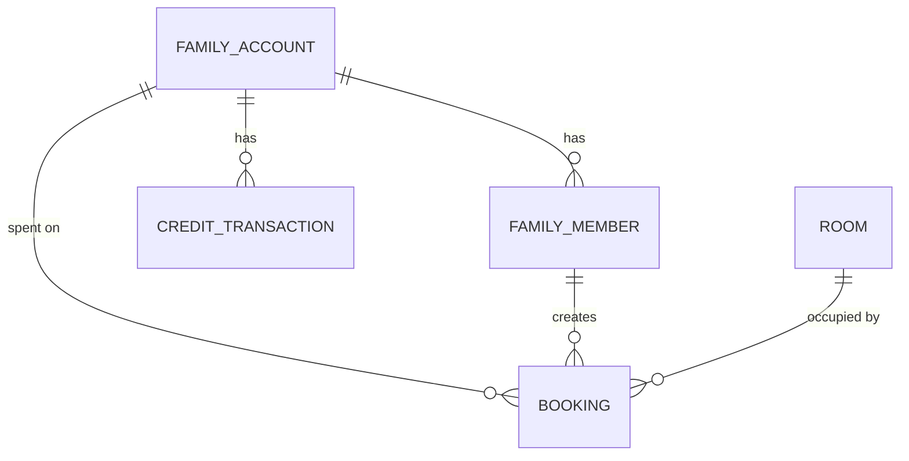

## 1. 架构设计

```mermaid
graph TD
    "浏览器客户端" --> "React 前端 (Vite)"
    "React 前端 (Vite)" --> "Express API 服务"
    "Express API 服务" --> "SQLite 数据库 (better-sqlite3)"
    "Express API 服务" --> "内存锁管理器 (并发控制)"
    "Express API 服务" --> "业务服务层"
    subgraph "业务服务层"
        "琴房服务"
        "预约服务(含合并/拆分)"
        "额度服务(含并发扣减)"
        "家庭账户服务"
        "统计服务"
    end
```

## 2. 技术描述

- **前端**：React@18 + TypeScript + Vite + tailwindcss@3 + zustand + react-router-dom + lucide-react + recharts
- **初始化工具**：vite-init（react-express-ts 模板）
- **后端**：Express@4 + TypeScript + better-sqlite3
- **数据库**：SQLite（文件存储，无需外部服务）
- **并发控制**：基于 Node.js 内存锁 + 数据库乐观锁（version 字段）双层保障
- **图标库**：lucide-react

## 3. 路由定义

### 前端路由

| 路由 | 页面组件 | 用途 |
|------|----------|------|
| / | HomePage | 首页 - 额度概览 + 琴房快览 |
| /schedule | SchedulePage | 琴房排期周视图 |
| /bookings | BookingsPage | 我的预约列表 |
| /family | FamilyPage | 家庭账户管理 |
| /statistics | StatisticsPage | 练琴统计 |
| /admin/rooms | AdminRoomsPage | 管理员 - 琴房管理 |

### 后端 API 路由

| 方法 | 路径 | 用途 |
|------|------|------|
| GET | /api/rooms | 获取琴房列表 |
| POST | /api/rooms | 创建琴房（管理员） |
| GET | /api/schedule | 获取指定日期范围的排期数据 |
| POST | /api/bookings | 创建预约（含合并逻辑+并发额度扣减） |
| DELETE | /api/bookings/:id | 退订预约（含拆分逻辑+额度退回） |
| GET | /api/bookings/mine | 获取当前用户预约列表 |
| GET | /api/family | 获取家庭账户信息（成员+额度） |
| POST | /api/family/members | 添加家庭成员 |
| DELETE | /api/family/members/:id | 移除家庭成员 |
| GET | /api/family/credits/transactions | 获取额度流水 |
| POST | /api/family/credits/recharge | 额度充值（管理员） |
| GET | /api/statistics/duration | 获取练琴时长统计 |
| POST | /api/auth/login | 模拟登录（设置当前用户） |

## 4. API 类型定义

```typescript
// 共享类型定义 (shared/types.ts)

export interface Room {
  id: string;
  name: string;
  type: 'upright' | 'grand' | 'digital';
  description: string;
  hourlyRate: number;
  createdAt: string;
}

export interface Booking {
  id: string;
  userId: string;
  familyId: string;
  roomId: string;
  startTime: string;
  endTime: string;
  durationMinutes: number;
  creditsUsed: number;
  isMerged: boolean;
  mergedFromIds: string[];
  createdAt: string;
  status: 'active' | 'cancelled';
}

export interface FamilyAccount {
  id: string;
  name: string;
  ownerId: string;
  creditsBalance: number;
  creditsTotal: number;
  version: number;
  createdAt: string;
}

export interface FamilyMember {
  id: string;
  familyId: string;
  name: string;
  role: 'owner' | 'member';
  avatar: string;
  createdAt: string;
}

export interface CreditTransaction {
  id: string;
  familyId: string;
  userId: string;
  type: 'recharge' | 'consume' | 'refund';
  amount: number;
  balanceAfter: number;
  bookingId?: string;
  description: string;
  createdAt: string;
}

export interface ScheduleSlot {
  roomId: string;
  date: string;
  startTime: string;
  endTime: string;
  bookingId: string | null;
  userId: string | null;
  available: boolean;
}

// 请求/响应类型
export interface CreateBookingRequest {
  roomId: string;
  startTime: string;
  endTime: string;
}

export interface CreateBookingResponse {
  success: boolean;
  booking?: Booking;
  message?: string;
}

export interface DurationStats {
  date: string;
  durationMinutes: number;
}

export interface MemberRanking {
  userId: string;
  name: string;
  durationMinutes: number;
}
```

## 5. 后端服务分层

```mermaid
graph TD
    "路由层 (Routes)" --> "控制器 (Controllers)"
    "控制器" --> "服务层 (Services)"
    "服务层" --> "数据访问层 (Repositories)"
    "数据访问层" --> "SQLite 数据库"
    "服务层" --> "锁管理器 (LockManager)"
    "锁管理器" --> "内存锁 Map + 版本号校验"
```

- **controllers/**：处理 HTTP 请求、参数校验、响应格式化
- **services/**：核心业务逻辑（预约合并/拆分、额度并发扣减、统计计算）
- **repositories/**：数据库 CRUD 操作封装
- **utils/**：锁管理器、时间计算、额度计算等工具
- **db/**：数据库连接与初始化脚本

## 6. 数据模型

### 6.1 ER 图



### 6.2 DDL

```sql
-- 家庭账户表
CREATE TABLE family_accounts (
  id TEXT PRIMARY KEY,
  name TEXT NOT NULL,
  owner_id TEXT NOT NULL,
  credits_balance REAL NOT NULL DEFAULT 0,
  credits_total REAL NOT NULL DEFAULT 0,
  version INTEGER NOT NULL DEFAULT 0,
  created_at TEXT NOT NULL
);

-- 家庭成员表
CREATE TABLE family_members (
  id TEXT PRIMARY KEY,
  family_id TEXT NOT NULL REFERENCES family_accounts(id),
  name TEXT NOT NULL,
  role TEXT NOT NULL CHECK(role IN ('owner', 'member')),
  avatar TEXT NOT NULL,
  created_at TEXT NOT NULL
);

-- 琴房表
CREATE TABLE rooms (
  id TEXT PRIMARY KEY,
  name TEXT NOT NULL,
  type TEXT NOT NULL CHECK(type IN ('upright', 'grand', 'digital')),
  description TEXT NOT NULL,
  hourly_rate REAL NOT NULL,
  created_at TEXT NOT NULL
);

-- 预约表
CREATE TABLE bookings (
  id TEXT PRIMARY KEY,
  user_id TEXT NOT NULL REFERENCES family_members(id),
  family_id TEXT NOT NULL REFERENCES family_accounts(id),
  room_id TEXT NOT NULL REFERENCES rooms(id),
  start_time TEXT NOT NULL,
  end_time TEXT NOT NULL,
  duration_minutes INTEGER NOT NULL,
  credits_used REAL NOT NULL,
  is_merged INTEGER NOT NULL DEFAULT 0,
  merged_from_ids TEXT NOT NULL DEFAULT '[]',
  status TEXT NOT NULL DEFAULT 'active' CHECK(status IN ('active', 'cancelled')),
  created_at TEXT NOT NULL
);

-- 额度流水表
CREATE TABLE credit_transactions (
  id TEXT PRIMARY KEY,
  family_id TEXT NOT NULL REFERENCES family_accounts(id),
  user_id TEXT NOT NULL REFERENCES family_members(id),
  type TEXT NOT NULL CHECK(type IN ('recharge', 'consume', 'refund')),
  amount REAL NOT NULL,
  balance_after REAL NOT NULL,
  booking_id TEXT REFERENCES bookings(id),
  description TEXT NOT NULL,
  created_at TEXT NOT NULL
);

-- 索引
CREATE INDEX idx_bookings_room_time ON bookings(room_id, start_time, end_time, status);
CREATE INDEX idx_bookings_user ON bookings(user_id, status);
CREATE INDEX idx_bookings_family ON bookings(family_id);
CREATE INDEX idx_transactions_family ON credit_transactions(family_id, created_at);
```

### 6.3 初始数据

```sql
-- 默认琴房
INSERT INTO rooms (id, name, type, description, hourly_rate, created_at) VALUES
('room-1', 'A101 立式琴房', 'upright', '雅马哈 U1 立式钢琴，环境安静', 1.0, datetime('now')),
('room-2', 'A102 立式琴房', 'upright', '卡瓦依 K300 立式钢琴', 1.0, datetime('now')),
('room-3', 'B201 三角琴房', 'grand', '雅马哈 C3 三角钢琴，专业演奏级', 2.0, datetime('now')),
('room-4', 'C301 数码琴房', 'digital', '罗兰 HP704 数码钢琴，戴耳机练习', 0.5, datetime('now'));

-- 默认家庭账户
INSERT INTO family_accounts (id, name, owner_id, credits_balance, credits_total, version, created_at) VALUES
('family-1', '李氏家庭', 'user-1', 10.0, 10.0, 0, datetime('now'));

-- 默认家庭成员
INSERT INTO family_members (id, family_id, name, role, avatar, created_at) VALUES
('user-1', 'family-1', '李爸爸', 'owner', '👨', datetime('now')),
('user-2', 'family-1', '李小明', 'member', '👦', datetime('now')),
('user-3', 'family-1', '李小红', 'member', '👧', datetime('now'));

-- 模拟充值记录
INSERT INTO credit_transactions (id, family_id, user_id, type, amount, balance_after, description, created_at) VALUES
('txn-1', 'family-1', 'user-1', 'recharge', 10.0, 10.0, '初始充值 10 小时', datetime('now'));
```
